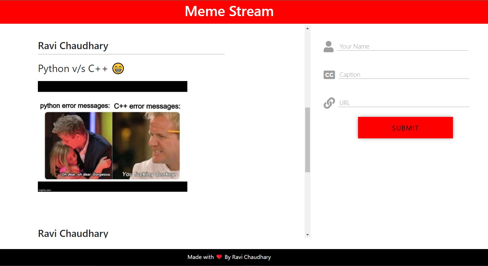

# Meme Stream(XMeme)

Meme Stream is a social website where people can post their Funny & Creative Memes to show to the World. It also provides a built in REST API to fetch the memes which you can use in your personal website or anything else.

## Deployed Project [Link](https://malhotraravi842.pythonanywhere.com/)
### A Walkthrough of the Project [Video Link](https://youtu.be/CVXy_ob5uk8)



## Tech Stack Used
- Django
- Django Rest Framework
- Django Rest Swagger(For API Documentation)
- HTML, CSS & JavaScript for Frontend

## Installation on Local Machine

Use the package manager [pip](https://pip.pypa.io/en/stable/) to setup this Django project.

```bash
pip install virtualenv

virtualenv myprojectenv

source myprojectenv/bin/acctivate

pip install -r requirements.txt

python manage.py makemigrations

python manage.py migrate

```

### WooHoo! Your project is got confgured now. Enjoy the Memes ;)

## Deployment(Azure Compute Engine or AWS EC2)
```bash
chmod +x test_server.sh

sudo ./test_server.sh
```